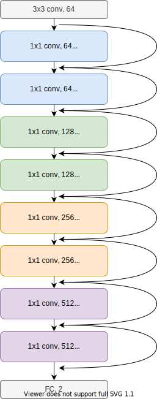

# Introduction

In this work we utilize BagNets to perform Breast cancer classification. Using BagNet's local image patches we want to analyze the model's decision making. We aim to visualize and compare the local image patches for decision making (Bag of features) with ROI identified by doctors. 
 
# BagNet Architecture
The Current BagNet architecture is based on the ResNet50 model. The main adjustment in the ResNet is architecture is reduced kernel sizes in the Bottleneck layers. Due to BagNet's relatively large intermediate representations, the model's memory consumption is high. This can be troublesome with high resolution mammograms in this task. Therefore we propose smaller version of BagNet, based on ResNet18. In Figure 1 an overview is provided of the adapted architecture.

# About
This work is done for the course Research Experiments in Databases and Information Retrieval by Suzanne Spinks and Leander van den Heuvel

